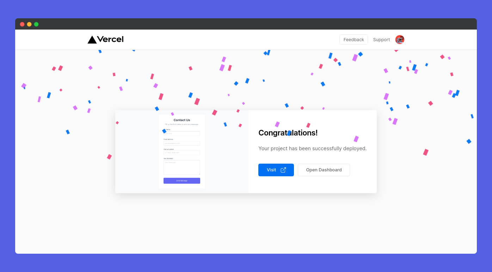

# Vercel

## Step 01: Get Access Key

First step is to get an Access Key from Web3Forms. [Create Access Key](https://web3forms.com/#start)

Once you submit the form, you will get the Access key in your Email. Copy that key so that we can use this later.

## Step 2: Create HTML Form

Create a form in your website with our form endpoint inside action attribute. Read more [getting-started/installation](https://docs.web3forms.com/getting-started/installation) Following is a simple example on how it should look like:




```markup
<form action="https://api.web3forms.com/submit" method="POST">

    <input type="hidden" name="apikey" value="YOUR_ACCESS_KEY_HERE">

    <input type="text" name="name" required>
    <input type="email" name="email" required>
    <textarea name="message" required></textarea>
    <input type="hidden" name="redirect" value="https://web3forms.com/success">
    <button type="submit">Submit Form</button>

</form>
```





```markup
<form action="https://api.web3forms.com/submit" method="POST">

    <!-- REQUIRED: Your Access key here. Don't worry this can be public -->
    <!-- Create your Access key here: https://web3forms.com/ -->
    <!-- <input type="hidden" name="apikey" value="YOUR_ACCESS_KEY_HERE"> -->
    <input type="hidden" name="apikey" value="YOUR_ACCESS_KEY_HERE">

    <!-- Optional: Can be type="hidden" or type="text" for subject -->
    <input type="hidden" name="subject" value="New Submission from Web3Forms">

    <!-- Optional: To send the form submission as CC email -->
    <input type="hidden" name="ccemail" value="partner@example.com">

    <!-- Optional: default replyto will be "email" (if available),
         you may overwrite here -->
    <input type="hidden" name="replyto" value="customer@example.com">

    <!-- Required: if submitting without Javascript
         (because by default web3form outputs json) -->

    <!-- If javascript, use "window.location.hash" for redirects -->
    <input type="hidden" name="redirect" value="https://web3forms.com/success">

    <!-- Optional: But Recommended: To Prevent SPAM Submission.
         Make sure its hidden by default -->
    <input type="checkbox" name="botcheck" id="" style="display: none;">

    <!-- Google reCaptcha v3: To Prevent SPAM Submission.PRO Plan only -->
    <input type="hidden" name="recaptcha_response" id="recaptchaResponse">

    <!-- Custom Form Data:
     Then you can include your own form data you wish to receive in email. -->
    <input type="email" name="email" required>
    <input type="text" name="First Name" required>
    <input type="text" name="Phone Number" required>
    <textarea name="message" cols="30" rows="10" required></textarea>

    <button type="submit">Submit Form</button>

</form>
```




## Step 03: Create an account on Github


First Step is to create a Github account if you don't already have one.

## Step 04: Create a GIT Repository

Now, you should create a new GitHub repository and add your `html` files to your repo.

## Step 05: Create an account on Vercel


The next Step is to create an account on [vercel.com](https://vercel.com/) or you can login to Vercel. You can make use of login with Github. This will make it easy to connect your repository.

## Step 06: Create a New Project

Now, click [New Project](https://vercel.com/new) button from your dashboard.

## Step 07: Import GIT Repository to Vercel


Now, you can see your repos, click on **Import** button near the repo you want to import.

## Step 08: Set Vercel Scope


Now, you can see your repos, click on **Import** button near the repo you want to import.

## Step 09: Deploy Vercel App


Configure you name and settings. Click on **Deploy** button. You're good to go!

## Step 10: Congratulations! You're App is depoyed


Congrats, You're app is now deployed on vercel. You can now visit it! It will work absolutely fine. Well done! 👏

## Test App


Now, here comes the final part! It is time to test. Head over to the app, and submit the form. Open your mail, you can see a new one. It will look like this 👇



