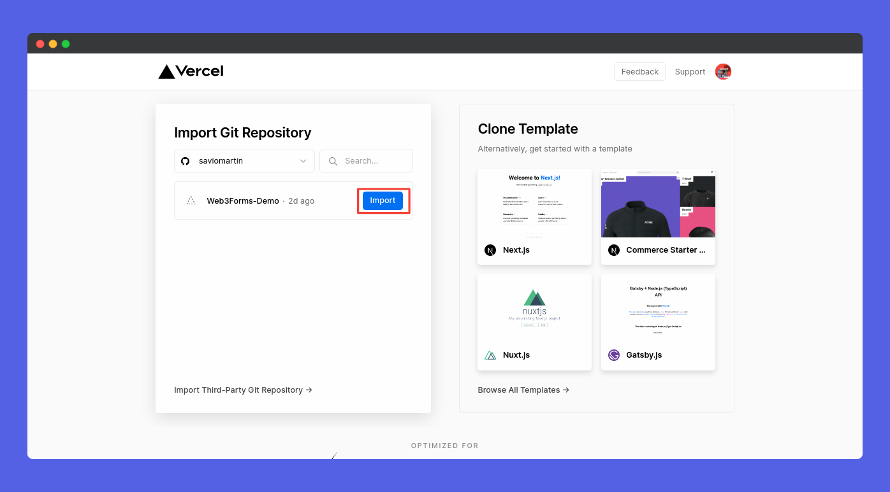

# Vercel

## Step 01: Create HTML Form

First of all we need to create a `html` page with web3forms. Learn how to setup on our [installation](https://docs.web3forms.com/getting-started/installation) page.

## Step 02: Create an account on Github

First Step is to create a Github account if you don't already have one.

## Step 03: Create a GIT Repository

Now, you should create a new GitHub repository and add your `html` files to your repo.

## Step 04: Create an account on Vercel

The next Step is to create an account on [vercel.com](https://vercel.com/) or you can login to Vercel. You can make use of login with Github. This will make it easy to connect your repository.

## Step 05: Create a New Project

Now, click [New Project](https://vercel.com/new) button from your dashboard.

## Step 06: Import GIT Repository to Vercel

Now, you can see your repos, click on **Import** button near the repo you want to import.

## Step 07: Set Vercel Scope

Now, you can see your repos, click on **Import** button near the repo you want to import.

## Step 08: Deploy Vercel App

Configure you name and settings. Click on **Deploy** button. You're good to go!

## Step 09: Congratulations! You're App is depoyed

Congrats, You're app is now deployed on vercel. You can now visit it! It will work absolutely fine. Well done! 👏

## Test App

Now, here comes the final part! It is time to test. Head over to the app, and submit the form. Open your mail, you can see a new one. It will look like this 👇


